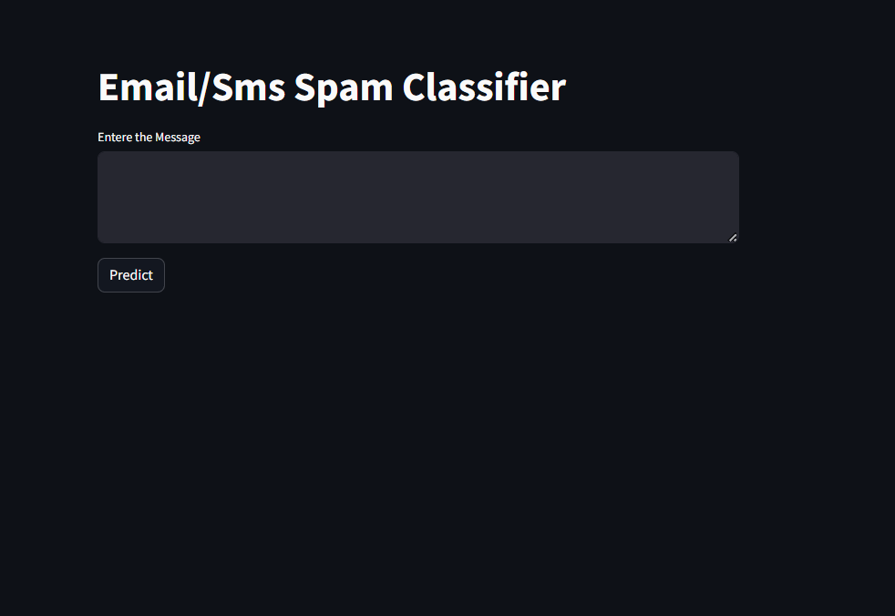
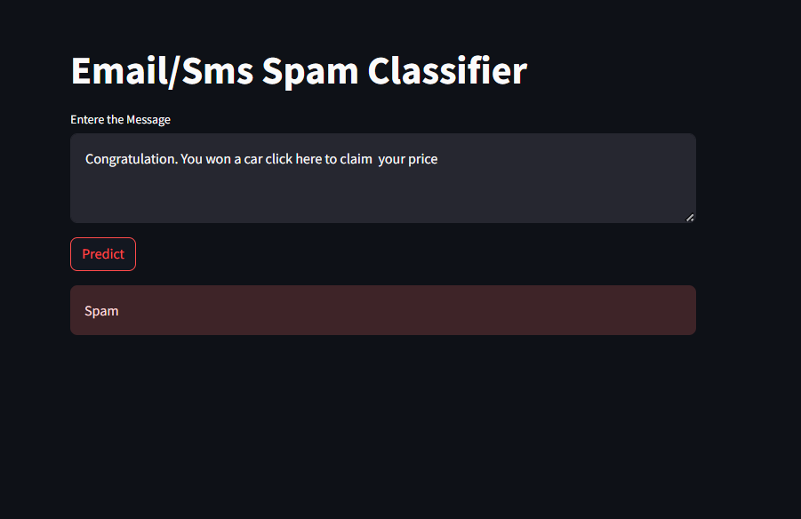

# Email and SMS Spam Detector using Sklearn's Naive Bayes

## Introduction
This project is an email and SMS spam detector that uses the naive Bayes algorithm from `sklearn` to classify messages as spam or not spam. The classifier leverages natural language processing techniques for feature extraction and classification.

## Features
- High accuracy in detecting spam messages.
- Supports both email and SMS message formats.
- Easy integration into existing systems.
- Extensible for additional message types and languages.


## Screenshots

### Homepage


### Details Page



## Installation
To get started with this project, clone the repository and install the required dependencies:
```bash
git clone https://github.com/nikitbisht/email-sms-spam-detector.git

cd email-sms-spam-detector

pip install -r requirements.txt
```

## Contributing

Contributions are welcome! Please follow these guidelines when contributing to the project:

- If you encounter a bug or would like to request a new feature, please open an issue on GitHub.
- If you would like to contribute code changes, please fork the repository and submit a pull request.
- Before submitting a pull request, make sure your code follows the project's coding style and conventions.
- When submitting a pull request, provide a clear description of the changes and any relevant information.

## License

This project is licensed under the MIT License - see the [LICENSE](LICENSE) file for details.